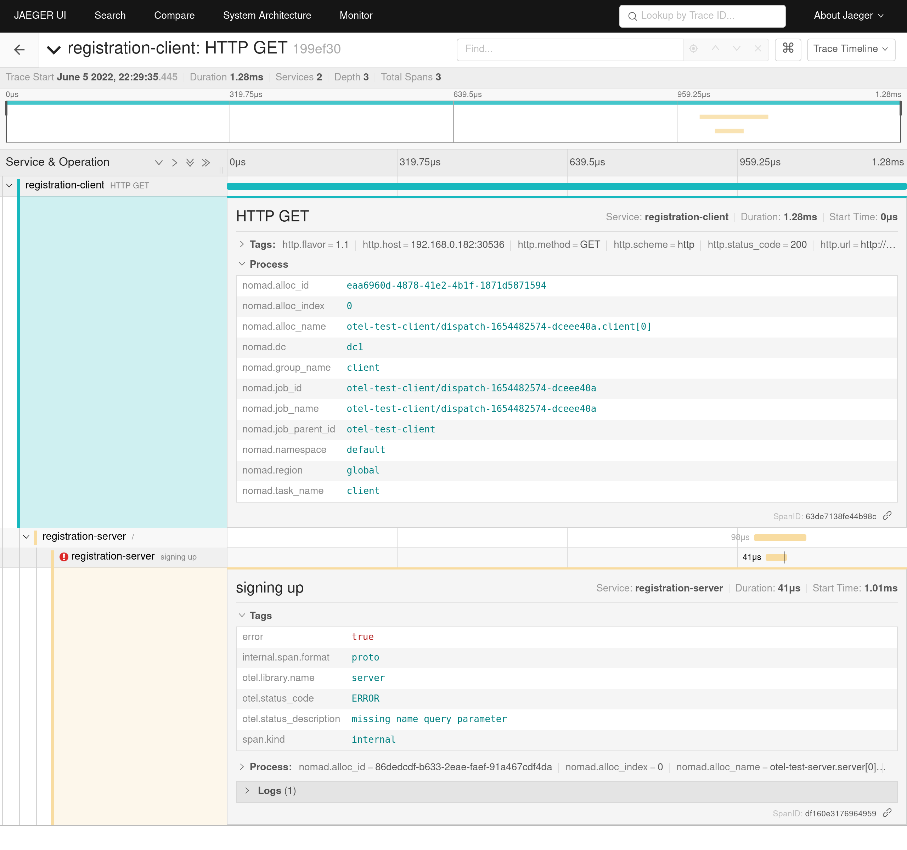

# go-otel-instrumentation

This is a fork of
[avillela/go-otel-instrumentation](https://github.com/avillela/go-otel-instrumentation).

It refactors the sample app to read configuration values from environment
variables and CLI flags. It also loads the [Nomad resource
detector](https://github.com/lgfa29/opentelemetry-go-contrib/tree/detector-nomad/detectors/nomad)
to set Nomad related attributes into traces.

## Quick Start

Start a local Nomad dev agent, binding to a private network interface instead
of the default loopback interface:

```console
$ sudo nomad agent -dev -bind=0.0.0.0 -network-interface='{{GetPrivateInterfaces | attr "name"}}'
==> No configuration files loaded
==> Starting Nomad agent...
==> Nomad agent configuration:

       Advertise Addrs: HTTP: 192.168.0.182:4646; RPC: 192.168.0.182:4647; Serf: 192.168.0.182:4648
            Bind Addrs: HTTP: [0.0.0.0:4646]; RPC: 0.0.0.0:4647; Serf: 0.0.0.0:4648
                Client: true
             Log Level: DEBUG
                Region: global (DC: dc1)
                Server: true
               Version: 1.3.1

==> Nomad agent started! Log data will stream in below:
...
```

Run the base observability services:

```console
$ nomad run nomad/o11y-platform.nomad
==> 2022-06-05T22:26:34-04:00: Monitoring evaluation "8351b3bd"
    2022-06-05T22:26:34-04:00: Evaluation triggered by job "o11y-platform"
    2022-06-05T22:26:34-04:00: Allocation "30570e92" created: node "d0ddcb3b", group "otel-collector"
    2022-06-05T22:26:34-04:00: Allocation "d96949cc" created: node "d0ddcb3b", group "jaeger"
    2022-06-05T22:26:34-04:00: Allocation "e80a57d2" created: node "d0ddcb3b", group "prometheus"
==> 2022-06-05T22:26:35-04:00: Monitoring evaluation "8351b3bd"
    2022-06-05T22:26:35-04:00: Evaluation within deployment: "5ebc5764"
    2022-06-05T22:26:35-04:00: Allocation "30570e92" status changed: "pending" -> "running" (Tasks are running)
    2022-06-05T22:26:35-04:00: Evaluation status changed: "pending" -> "complete"
==> 2022-06-05T22:26:35-04:00: Evaluation "8351b3bd" finished with status "complete"
==> 2022-06-05T22:26:35-04:00: Monitoring deployment "5ebc5764"
  ✓ Deployment "5ebc5764" successful

    2022-06-05T22:26:46-04:00
    ID          = 5ebc5764
    Job ID      = o11y-platform
    Job Version = 0
    Status      = successful
    Description = Deployment completed successfully

    Deployed
    Task Group      Desired  Placed  Healthy  Unhealthy  Progress Deadline
    jaeger          1        1       1        0          2022-06-05T22:36:45-04:00
    otel-collector  1        1       1        0          2022-06-05T22:36:44-04:00
    prometheus      1        1       1        0          2022-06-05T22:36:45-04:00
```

Run the test server job:

```console
$ nomad run nomad/otel-test-server.nomad
==> 2022-06-05T22:27:09-04:00: Monitoring evaluation "7dc2dae3"
    2022-06-05T22:27:09-04:00: Evaluation triggered by job "otel-test-server"
    2022-06-05T22:27:09-04:00: Evaluation within deployment: "c1f0f87a"
    2022-06-05T22:27:09-04:00: Evaluation status changed: "pending" -> "complete"
==> 2022-06-05T22:27:09-04:00: Evaluation "7dc2dae3" finished with status "complete"
==> 2022-06-05T22:27:09-04:00: Monitoring deployment "c1f0f87a"
  ✓ Deployment "c1f0f87a" successful

    2022-06-05T22:27:09-04:00
    ID          = c1f0f87a
    Job ID      = otel-test-server
    Job Version = 0
    Status      = successful
    Description = Deployment completed successfully

    Deployed
    Task Group  Desired  Placed  Healthy  Unhealthy  Progress Deadline
    server      1        3       1        2          2022-06-05T22:08:51-04:00
```

Register the test client job:

```console
$ nomad run nomad/otel-test-client.nomad
Job registration successful
```

Dispatch a job with a user name:

```console
$ nomad job dispatch -meta name="Kathryn Janeway" otel-test-client
Dispatched Job ID = otel-test-client/dispatch-1654482535-051ebb11
Evaluation ID     = 09fc4e9d

==> 2022-06-05T22:28:55-04:00: Monitoring evaluation "09fc4e9d"
    2022-06-05T22:28:55-04:00: Evaluation triggered by job "otel-test-client/dispatch-1654482535-051ebb11"
    2022-06-05T22:28:55-04:00: Allocation "ddce54a2" created: node "d0ddcb3b", group "client"
==> 2022-06-05T22:28:56-04:00: Monitoring evaluation "09fc4e9d"
    2022-06-05T22:28:56-04:00: Allocation "ddce54a2" status changed: "pending" -> "complete" (All tasks have completed)
    2022-06-05T22:28:56-04:00: Evaluation status changed: "pending" -> "complete"
==> 2022-06-05T22:28:56-04:00: Evaluation "09fc4e9d" finished with status "complete"
```

Dispatch a job without a user name:

```console
$ nomad job dispatch otel-test-client
Dispatched Job ID = otel-test-client/dispatch-1654482574-dceee40a
Evaluation ID     = a9ede1be

==> 2022-06-05T22:29:34-04:00: Monitoring evaluation "a9ede1be"
    2022-06-05T22:29:34-04:00: Evaluation triggered by job "otel-test-client/dispatch-1654482574-dceee40a"
    2022-06-05T22:29:34-04:00: Allocation "eaa6960d" created: node "d0ddcb3b", group "client"
==> 2022-06-05T22:29:35-04:00: Monitoring evaluation "a9ede1be"
    2022-06-05T22:29:35-04:00: Allocation "eaa6960d" status changed: "pending" -> "complete" (All tasks have completed)
    2022-06-05T22:29:35-04:00: Evaluation status changed: "pending" -> "complete"
==> 2022-06-05T22:29:35-04:00: Evaluation "a9ede1be" finished with status "complete"
```

Access the Jaeger UI at `http://<YOUR IP>:16686` and click `Find Traces`. You
will see two traces, one for each of the dispatched job. The request without
user name will be tagged with an error and both traces will be enhanced with
Nomad environment attributes.



## Configuration

The test application can run in two modes, `server` and `client`. This is set
by the first CLI argument:

```console
$ otel-instrumentation server
$ otel-instrumentation client
```

OpenTelemetry configuration is defined via environment variables. The following
variables can be set:

* `OTEL_COLLECTOR_ADDR` `("127.0.0.1:1111")` - The address of the OpenTelemetry
  Collector.
* `OTEL_COLLECTOR_PROTO` `("http")` - The protocol for communicating with the
  OpenTelemetry collector. Valid options are `http` or `grcp`.

When running in `server` mode the following environment variables can be set:

* `BIND_ADDR` `(":9000")` - The IP and port for binding the HTTP server.

When running in `client` mode the following environment variables can be set:

* `SERVER_URL` `("http://127.0.0.1:9000")` - The URL for reaching the test
  server.

You can also set the following CLI flags in `client` mode:

* `-name` `(string: "Kathryn Janeway")` - The name set in the request to the
  server.

## Building

If you have the Go toolchain installed you can build the sample app by running:

```console
$ go build -o otel-instrumentation .
```

You can also build the Docker image:

```console
$ docker build -t otel-instrumentation:v1 .
```
